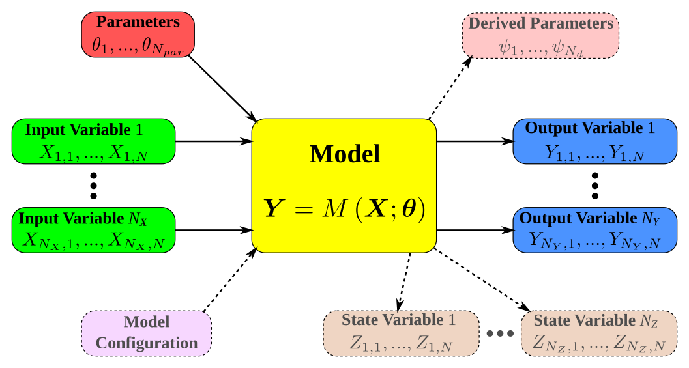

**BaM (Bayesian Modeling) is a framework aimed at estimating a model using a Bayesian approach and using it for prediction. Uncertainties are at the core of BaM: integration of uncertainties affecting calibration data, quantification of uncertainties affecting the model's predictions.**

BaM includes several open-source codes:
* The computational engine [BaM](https://github.com/BaM-tools/BaM) is a Fortran executable implementing the main steps of Bayesian inference, in particular the computation of the posterior distribution and its exploration with MCMC (Markov Chain Monte Carlo) samplers. 
* The R package [RBaM](https://github.com/BaM-tools/RBaM) allows controlling this computational engine from [R](https://www.r-project.org/), and thereby eases model definition, prior specification, data manipulation, the exploitation of MCMC simulations and the realization of uncertain predictions.
* The Python package [PBaM](https://github.com/BaM-tools/PBaM) follows the same objectives with [Python](https://www.python.org/), but is still in an early stage of development.

BaM's framework is model-agnostic: it provides a generic estimation method that does not depend on the calibrated model, and can hence be applied (in theory at least) to any model. BaM has already been used to estimate the parameters and uncertainties of a wide range of models, including [standard rating curves](https://github.com/NEONScience/NEON-stream-discharge) or more complex ones ([twin-gauge](https://doi.org/10.1002/2016WR018916), [multi-period](https://doi.org/10.1029/2018WR023389), influenced by [vegetation](https://doi.org/10.1029/2020WR027745) or [tides](https://hal.science/hal-01745487v1)), optical [orthorectification](https://hal.science/hal-03465105v1) models, hydrological (XXX) or [hydrodynamic](https://hal.science/hal-05725973v1) models, [sediment transport](https://hal.science/hal-03948254v1) models, [segmentation](https://doi.org/10.1029/2020WR028607) procedures, etc.

  
Illustration of the generic model object manipulated by BaM.

