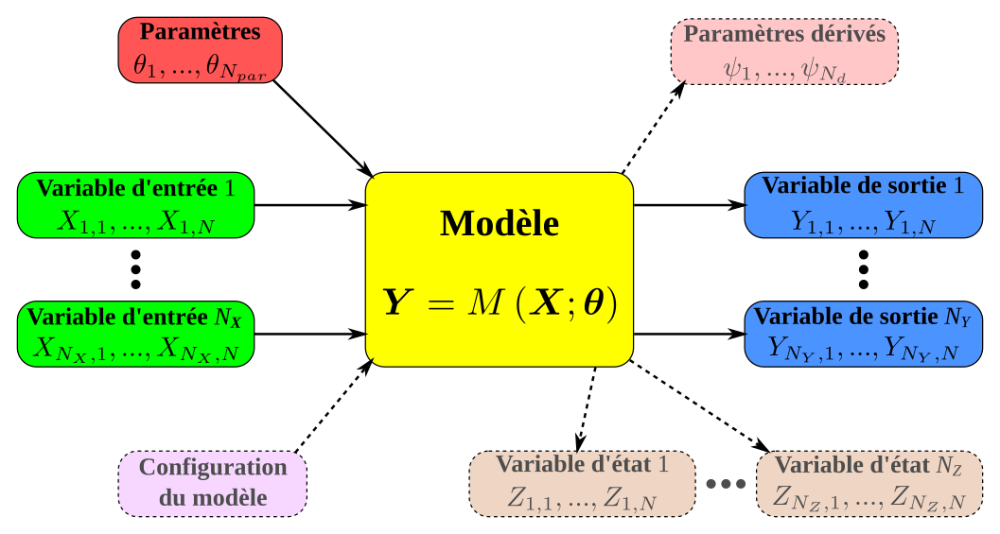

**BaM (Bayesian Modeling) est un cadre générique permettant d'estimer un modèle quelconque avec une approche Bayesienne, et d'utiliser le modèle pour générer des prédictions. La gestion des incertitudes est au coeur de BaM: prise en compte des incertitudes affectant les données de calage, quantification des incertitudes affectant les prédictions du modèle.**

L'outil BaM est composé de plusieurs briques qui sont toutes open-source :
* Le coeur de calcul [BaM](https://github.com/BaM-tools/BaM) est un exécutable Fortran qui implémente les principales étapes de l'inférence Bayesienne, en particulier le calcul de la distribution a posteriori et son exploration par des échantillonneurs MCMC (Monte Carlo par Chaînes de Markov). 
* Le package R [RBaM](https://github.com/BaM-tools/RBaM) permet de contrôler ce coeur de calcul depuis [R](https://www.r-project.org/), et facilite la définition du modèle à estimer, la spécification des distributions a priori, la manipulation des données de calage, l'exploitation des simulations MCMC et la réalisation de prédictions incertaines.
* Le package Python [PBaM](https://github.com/BaM-tools/PBaM) poursuit les mêmes objectifs sous [Python](https://www.python.org/), mais est encore dans une phase de développement moins avancée.

Le cadre de BaM est agnostique au modèle : il vise à proposer une méthode d'estimation générique qui soit indépendante du modèle utilisé et qui puisse donc être appliqué (du moins en théorie) à n'importe quel modèle. BaM a ainsi été utilisé pour l'estimation des paramètres et des incertitudes de modèles variés, comme par exemple des courbes de tarage [classiques](https://github.com/NEONScience/NEON-stream-discharge) ou plus complexes ([à double échelle](https://doi.org/10.1002/2016WR018916), [multi-périodes](https://doi.org/10.1029/2018WR023389), affectées par la [végétation](https://doi.org/10.1029/2020WR027745) ou la [marée](https://hal.science/hal-01745487v1)), des modèles optiques d'[orthorectification](https://hal.science/hal-03465105v1), des modèles hydrologiques (XXX) ou [hydrauliques](https://hal.science/hal-05725973v1), des modèles de [transport sédimentaire](https://hal.science/hal-03948254v1), des modèles de [segmentation](https://doi.org/10.1029/2020WR028607), etc.

  
Illustration de l'objet générique "modèle" manipulé par BaM.

