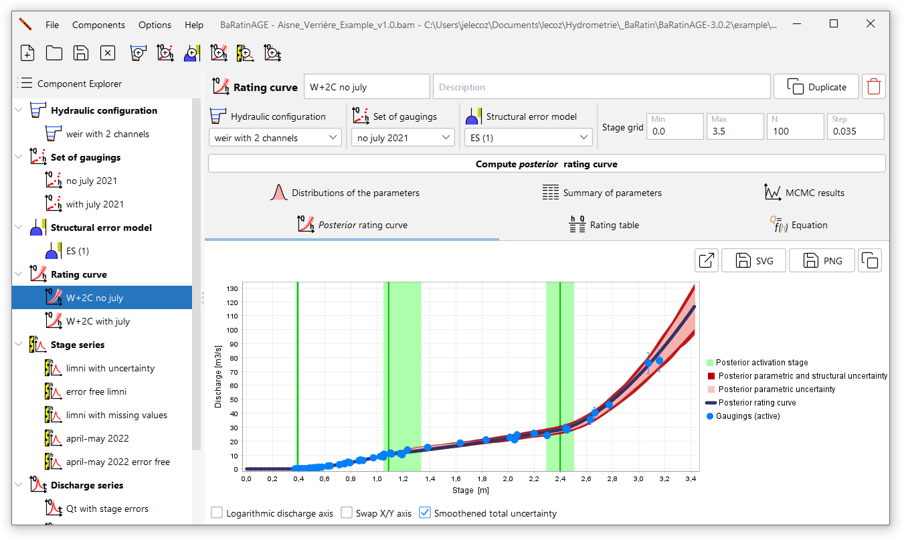

**To provide operational solutions to the difficult problems of developing, calibrating, reviewing simple and complex rating curves and estimating their uncertainties, the Bayesian BaRatin method (Bayesian Rating curve, [Le Coz et al., 2014](https://doi.org/10.1016/j.jhydrol.2013.11.016) ; [Horner et al., 2018](https://doi.org/10.1002/2017WR022039)) has been developed by INRAE since 2010. The development of methods for quantifying the uncertainties of hydrologic data and models is one of the team's research themes.**

The software [BaRatinAGE](https://github.com/BaRatin-tools/BaRatinAGE) is open-source and distributed in more than 25 languages (including French and English). The latest version is available [here](https://github.com/BaRatin-tools/BaRatinAGE/releases/latest) and you can find all the details as well as training materials in French, English and Spanish on [BaRatin's website](https://baratin-tools.github.io/en/). A video tutorial is also available [here](https://www.youtube.com/watch?v=TdRH1jmFhZQ).

  
Screenshot from BaRatinAGE.

The BaRatin method allows the construction of stage-discharge rating curves with uncertainty estimation, combining a priori knowledge on hydraulic controls and the information content of uncertain discharge measurements, a.k.a. gaugings [Le Coz et al., 2014](https://doi.org/10.1016/j.jhydrol.2013.11.016). The equation of the rating curve is derived from the combination of power functions for each of the assumed controls of the site. The user also defines the prior probability distributions of the physical parameters of this stage-discharge equation, "prior" meaning without looking at the gaugings used in the Bayesian estimation. Such a Bayesian estimation is based on the Monte Carlo Markov Chain Method (MCMC) sampling of the posterior distribution of the parameters of the rating curve, inferred from Bayes' theorem. Physical conflicts between the results and the assumed priors must be verified and may lead to questioning the rating curve model and the estimation of measurement uncertainties.

For any question or comment, please feel free to get in touch with us at baratin.dev /at/ listes.inrae.fr.

**If you use or plan to use the software, let us know so you are subscribed to the emailing list and receive updates and information.**

