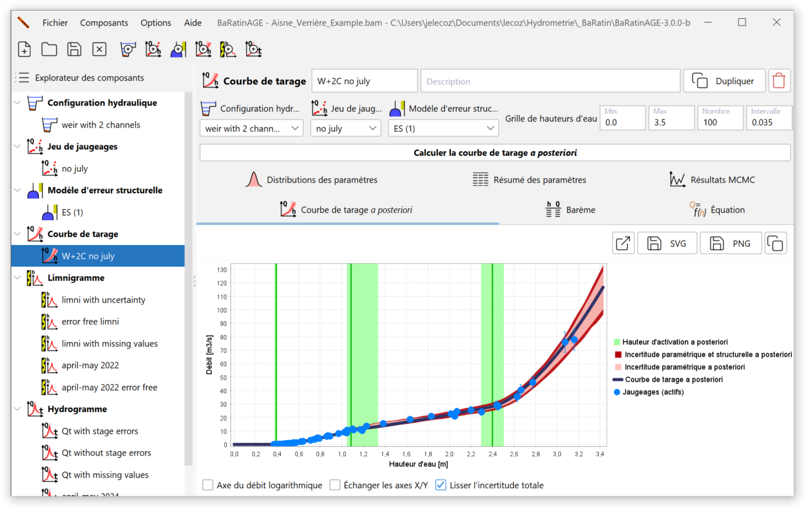

**Pour apporter des solutions opérationnelles aux problèmes délicats que posent la construction, le calage, la critique et l’estimation des incertitudes des courbes de tarage simples et complexes, la méthode bayésienne BaRatin (Bayesian Rating curve, [Le Coz et al., 2014](https://doi.org/10.1016/j.jhydrol.2013.11.016) ; [Horner et al., 2018](https://doi.org/10.1002/2017WR022039)) a été développée par INRAE depuis 2010. Le développement de méthodes pour la quantification des incertitudes des données et des modèles hydrologiques est un des thèmes de recherche de l'équipe.**

Le logiciel [BaRatinAGE](https://github.com/BaRatin-tools/BaRatinAGE) est open-source et diffusé en plus de 25 langues (dont le français et l'anglais). La dernière version est disponible [ici](https://github.com/BaRatin-tools/BaRatinAGE/releases) et vous trouverez tous les détails ainsi que des supports de formation en français, anglais et espagnol sur le [site web de BaRatin](https://baratin-tools.github.io/fr/). Un tutoriel vidéo est disponible [ici](https://www.youtube.com/watch?v=dUutJkCaAro).

  
Capture d'écran du logiciel BaRatinAGE.

La méthode BaRatin permet la construction des courbes de tarage hauteur-débit avec estimation de l'incertitude, en combinant la connaissance a priori sur les contrôles hydrauliques et le contenu d'information des jaugeages incertains [Le Coz et al., 2014](https://doi.org/10.1016/j.jhydrol.2013.11.016). L'équation de la courbe de tarage est dérivée de la combinaison de fonctions puissance pour chacun des contrôles supposés sur le site. L'utilisateur définit également les distributions de probabilité a priori des paramètres physiques de cette équation hauteur-débit, « a priori » signifiant sans regarder les jaugeages utilisés dans l’estimation bayésienne. Une telle estimation bayésienne est basée sur l’échantillonnage par méthode Monte Carlo par Chaîne de Markov (MCMC) de la distribution a posteriori des paramètres de la courbe de tarage, inférée à partir du théorème de Bayes. Les conflits physiques entre les résultats et les aprioris supposés doivent être vérifiés et peuvent conduire à remettre en question le modèle de courbe de tarage ainsi que l’estimation des incertitudes des jaugeages.

Pour toute question ou remarque, n'hésitez pas à nous contacter à baratin.dev /at/ listes.inrae.fr.

**Si vous utilisez ou envisagez d'utiliser le logiciel, faites-le nous savoir afin d'être inscrit(e) sur la liste de diffusion (si ce n'est pas déjà le cas) et de recevoir les mises à jour et les informations.**

