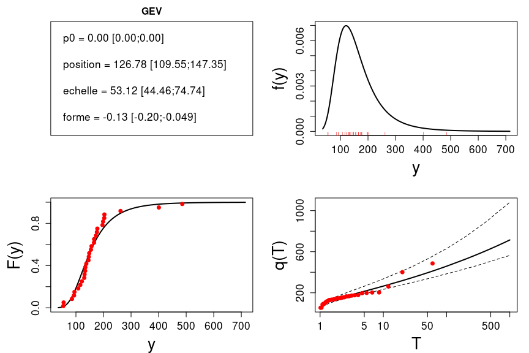

L'[HydroPortail](https://hydro.eaufrance.fr/) est le site de référence pour l'accès aux données hydrométriques et hydrologiques en France. En plus de sa vocation première de portail d'accès, il propose un certain nombre d'outils statistiques pour analyser les séries stockées en base, et en particulier pour estimer des débits caractéristiques (par exemple débit de crue décennal ou débit d'étiage quinquennal). Le package R [HydroPortailStats](https://github.com/benRenard/HydroPortailStats) contient tous les calculs statistiques effectués par l'HydroPortail, et propose un certain nombre d'outils supplémentaires tels que l'estimation Bayesienne d'une distribution ou le traitement de données historiques de crues, incomplètes et incertaines.

  
Exemple de sortie graphique du package HydroPortailStats.

