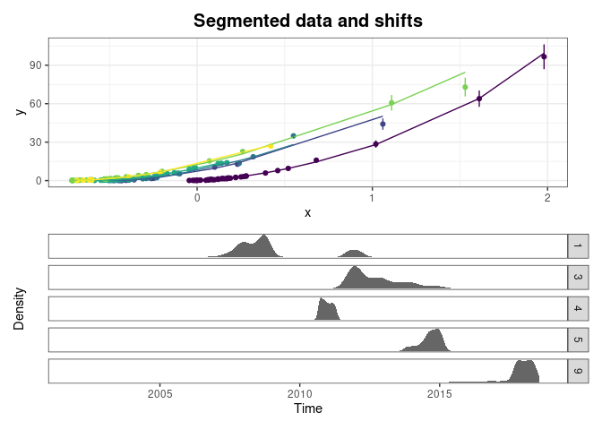
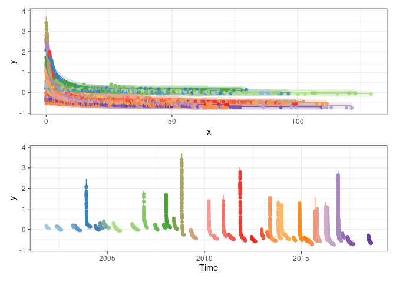
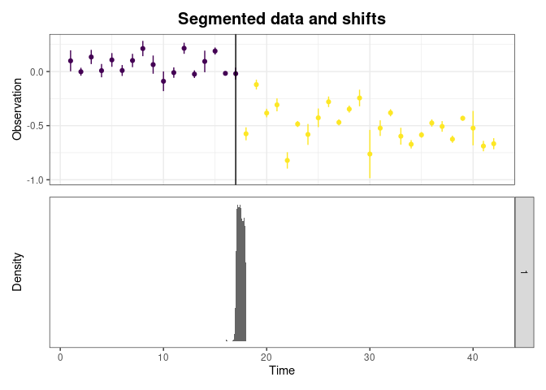

[ShiftHappens](https://github.com/benRenard/ShiftHappens) est un package R dédié à la détection, la visualisation et l'estimation de changements soudains dans des séries de données, avec une attention particulière portée aux applications hydrometriques et notamment à la détection de détarages. Le package est dérivé des travaux de [Mansanarez et al.](https://doi.org/10.1029/2018WR023389) (2019) et [Darienzo et al.](https://doi.org/10.1029/2020WR028607) (2021). 

Comme illustré dans la figure ci-dessous, le package permet de segmenter une série de données en plusieurs sous-périodes homogènes. La méthode utilisée a été dévelopée pour permettre la prise en compte des incertitudes qui affectent les données, et pour retourner également les incertitudes autour des dates de changement estimées.

  
Segmentation d'une série de données en sous périodes homogènes (haut), et incertitudes sur les dates de changements estimées, représentées sous la forme de densités de probabilité (bas). 

La méthode de segmentation peut également être utilisée pour détecter si la relation entre deux variables a changé. En particulier, lorsque cette relation est une courbe de tarage reliant la hauteur d'eau et le débit d'un cours d'eau, on obtient un outil de détection de détarages basé sur les jaugeages (hauteur, débit), comme illustré ci-dessous.

  
Identification de courbes de tarages homogènes (haut), et incertitudes sur les dates de détarage estimées, représentées sous la forme de densités de probabilité (bas). 

Le package propose également une méthode de détection de détarages basée sur l'analyse des récessions. Le principe est le suivant : lors des longues periodes de récession, le niveau de la rivière va tendre vers la hauteur du fond du lit. Un changement soudain dans les niveaux les plus bas atteints lors de telles récessions peut donc indiquer un changement dans la hauteur du fond du lit (creusement ou réhaussement suite à une crue par exemple), qui va induire un détarage.

  
Méthode d'analyse des récessions pour la détection de détarages. La figure de gauche illustre l'extraction de récessions (représentées depuis le début de la récession en haut ou en temps absolu en bas), la figure de droite illustre l'application d'une procédure de segmentation aux plus bas niveaux atteints lors de chaque récession. 

